# 🚀 Distributed File-Sharing Platform

A production-grade, microservices-based file-sharing platform built with modern cloud-native technologies. This platform provides secure file storage, sharing, and collaboration features with a scalable architecture.

## 📋 Table of Contents

- [Features](#-features)
- [Architecture](#-architecture)
- [Tech Stack](#-tech-stack)
- [Quick Start](#-quick-start)
- [Services Overview](#-services-overview)
- [API Documentation](#-api-documentation)
- [Configuration](#-configuration)
- [Deployment](#-deployment)
- [Development](#-development)
- [Monitoring](#-monitoring)
- [Security](#-security)
- [Contributing](#-contributing)

## ✨ Features

- **🔐 Secure Authentication** - JWT-based authentication with refresh tokens
- **📁 File Management** - Upload, download, organize, and version files
- **👥 File Sharing** - Share files with specific users or groups
- **🔔 Real-time Notifications** - Event-driven notifications for file activities
- **💳 Billing Integration** - Stripe integration for subscription management
- **📊 Analytics** - File usage and storage analytics
- **🌐 REST & gRPC APIs** - Dual API support for maximum flexibility
- **🐳 Containerized** - Full Docker and Kubernetes support
- **⚡ High Performance** - Redis caching and optimized storage

## 🏗️ Architecture

```mermaid
graph TB
    Client[Next.js Frontend]
    
    subgraph "API Layer"
        Gateway[API Gateway<br/>REST to gRPC]
    end
    
    subgraph "Microservices"
        Auth[Auth Service<br/>Go + Gin + gRPC]
        File[File Service<br/>Go + Gin + gRPC]
        Notif[Notification Service<br/>Go + Gin + gRPC]
        Billing[Billing Service<br/>Go + Gin + gRPC]
    end
    
    subgraph "Data Layer"
        Mongo[(MongoDB)]
        Cassandra[(Cassandra)]
        Storage[MinIO/S3<br/>Object Storage]
        Redis[(Redis Cache)]
    end
    
    subgraph "Messaging"
        Kafka[Kafka + Zookeeper]
    end
    
    Client -->|REST| Gateway
    Gateway -->|gRPC| Auth
    Gateway -->|gRPC| File
    Gateway -->|gRPC| Notif
    Gateway -->|gRPC| Billing
    
    Auth -.->|gRPC| File
    File -.->|gRPC| Auth
    File -.->|gRPC| Notif
    File -.->|gRPC| Billing
    
    Auth --> Mongo
    File --> Mongo
    File --> Cassandra
    File --> Storage
    File --> Redis
    Billing --> Mongo
    
    File -->|Events| Kafka
    Notif -->|Consume| Kafka
    
    style Client fill:#61dafb
    style Auth fill:#00add8
    style File fill:#00add8
    style Notif fill:#00add8
    style Billing fill:#00add8
    style Mongo fill:#47a248
    style Cassandra fill:#1287b1
    style Redis fill:#dc382d
    style Kafka fill:#231f20
```



## 🛠️ Tech Stack

### Frontend
- **Next.js 14** - React framework with App Router
- **TypeScript** - Type-safe development
- **TailwindCSS** - Utility-first CSS framework
- **shadcn/ui** - Modern UI component library
- **React Query** - Data fetching and caching
- **Zustand** - Lightweight state management

### Backend
- **Go 1.21+** - High-performance backend language
- **Gin** - HTTP web framework
- **gRPC** - High-performance RPC framework
- **Protocol Buffers** - Interface definition language
- **JWT** - JSON Web Tokens for authentication

### Data & Messaging
- **MongoDB** - Document database for metadata
- **Cassandra** - NoSQL database for file metadata and analytics
- **MinIO** - S3-compatible object storage
- **Redis** - In-memory data store for caching
- **Kafka + Zookeeper** - Event streaming platform

### Infrastructure
- **Docker** - Containerization platform
- **Kubernetes** - Container orchestration
- **Docker Compose** - Local development environment

## 🚀 Quick Start

### Prerequisites

- **Docker & Docker Compose** - [Install Docker](https://docs.docker.com/get-docker/)
- **Git** - [Install Git](https://git-scm.com/downloads)

### 1. Clone and Start

```bash
# Clone the repository
git clone <repository-url>
cd distributed-file-sharing-platform

# Start all services
docker-compose up -d --build
```

### 2. Access the Application

- **Frontend**: http://localhost:3000
- **API Gateway**: http://localhost:8080
- **MinIO Console**: http://localhost:9001 (minioadmin/minioadmin)

### 3. Verify Services

```bash
# Check service status
docker-compose ps

# View logs
docker-compose logs -f
```

## 🏢 Services Overview

### 🔐 Auth Service (Port: 8081)
**Purpose**: User authentication and authorization

**Features**:
- User registration and login
- JWT token generation and validation
- Password hashing with bcrypt
- User profile management
- Refresh token support

**Database**: MongoDB (`users` collection)

### 📁 File Service (Port: 8082)
**Purpose**: File management and storage

**Features**:
- File upload and download
- File metadata management
- File sharing and permissions
- File versioning
- Storage analytics
- Redis caching

**Databases**: 
- MongoDB (`files` collection)
- Cassandra (file metadata and analytics)
- MinIO (object storage)
- Redis (caching)

### 🔔 Notification Service (Port: 8083)
**Purpose**: Event processing and notifications

**Features**:
- Kafka event consumption
- Real-time notifications
- Notification history
- Email notifications (configurable)

**Events Consumed**:
- `file.uploaded`
- `file.shared`
- `file.deleted`

### 💳 Billing Service (Port: 8084)
**Purpose**: Payment and subscription management

**Features**:
- Stripe integration
- Subscription management
- Payment processing
- Usage tracking

### 🌐 API Gateway (Port: 8080)
**Purpose**: Single entry point for all API requests

**Features**:
- REST to gRPC translation
- Rate limiting
- CORS handling
- Request routing
- Authentication middleware

## 📚 API Documentation

### Authentication

#### Register User
```http
POST /api/v1/auth/register
Content-Type: application/json

{
  "email": "user@example.com",
  "password": "securePassword123",
  "full_name": "John Doe"
}
```

#### Login
```http
POST /api/v1/auth/login
Content-Type: application/json

{
  "email": "user@example.com",
  "password": "securePassword123"
}
```

#### Validate Token
```http
GET /api/v1/auth/validate
Authorization: Bearer <token>
```

### File Management

#### Upload File
```http
POST /api/v1/files/upload
Authorization: Bearer <token>
Content-Type: multipart/form-data

file: <binary data>
name: document.pdf
description: Important document
```

#### List Files
```http
GET /api/v1/files?page=1&limit=20&sort=created_at_desc
Authorization: Bearer <token>
```

#### Download File
```http
GET /api/v1/files/{file_id}/download
Authorization: Bearer <token>
```

#### Share File
```http
POST /api/v1/files/{file_id}/share
Authorization: Bearer <token>
Content-Type: application/json

{
  "user_emails": ["user2@example.com"],
  "permission": "read"
}
```

### Notifications

#### Get Notifications
```http
GET /api/v1/notifications?page=1&limit=20&unread_only=false
Authorization: Bearer <token>
```

#### Mark as Read
```http
PUT /api/v1/notifications/{notification_id}/read
Authorization: Bearer <token>
```

## ⚙️ Configuration

### Environment Variables

#### Auth Service
```env
AUTH_SERVICE_PORT=8081
AUTH_GRPC_PORT=50051
MONGO_URI=mongodb://mongodb:27017
MONGO_DATABASE=file_sharing
JWT_SECRET=your-super-secret-key
JWT_EXPIRY=3600
JWT_REFRESH_EXPIRY=604800
```

#### File Service
```env
FILE_SERVICE_PORT=8082
FILE_GRPC_PORT=50052
MONGO_URI=mongodb://mongodb:27017
MONGO_DATABASE=file_sharing
CASSANDRA_HOSTS=cassandra:9042
CASSANDRA_KEYSPACE=file_sharing
STORAGE_TYPE=minio
MINIO_ENDPOINT=minio:9000
MINIO_ACCESS_KEY=minioadmin
MINIO_SECRET_KEY=minioadmin
KAFKA_BROKERS=kafka:9092
REDIS_ADDR=redis:6379
```

#### Notification Service
```env
NOTIFICATION_SERVICE_PORT=8083
NOTIFICATION_GRPC_PORT=50053
MONGO_URI=mongodb://mongodb:27017
MONGO_DATABASE=file_sharing
KAFKA_BROKERS=kafka:9092
KAFKA_GROUP_ID=notification-service
```

#### Billing Service
```env
BILLING_SERVICE_PORT=8084
BILLING_GRPC_PORT=50054
MONGO_URI=mongodb://mongodb:27017
MONGO_DATABASE=file_sharing
STRIPE_SECRET_KEY=sk_test_your_secret_key
STRIPE_PUBLISHABLE_KEY=pk_test_your_publishable_key
```

## 🚀 Deployment

### Docker Compose (Recommended for Development)

```bash
# Start all services
docker-compose up -d --build

# Stop all services
docker-compose down

# View logs
docker-compose logs -f [service-name]
```

### Kubernetes (Production)

```bash
# Create namespace
kubectl apply -f k8s/namespace.yaml

# Deploy infrastructure
kubectl apply -f k8s/mongodb/
kubectl apply -f k8s/cassandra/
kubectl apply -f k8s/kafka/
kubectl apply -f k8s/minio/
kubectl apply -f k8s/redis/

# Deploy microservices
kubectl apply -f k8s/auth-service/
kubectl apply -f k8s/file-service/
kubectl apply -f k8s/notification-service/
kubectl apply -f k8s/billing-service/
kubectl apply -f k8s/api-gateway/

# Deploy frontend
kubectl apply -f k8s/frontend/
```

## 💻 Development

### Local Development Setup

1. **Install Dependencies**
```bash
# Go dependencies
cd services/auth-service && go mod download && cd ../..
cd services/file-service && go mod download && cd ../..
cd services/notification-service && go mod download && cd ../..
cd services/billing-service && go mod download && cd ../..

# Frontend dependencies
cd frontend && npm install && cd ..
```

2. **Generate gRPC Code**
```bash
# Install protoc plugins
go install google.golang.org/protobuf/cmd/protoc-gen-go@latest
go install google.golang.org/grpc/cmd/protoc-gen-go-grpc@latest
go install github.com/grpc-ecosystem/grpc-gateway/v2/protoc-gen-grpc-gateway@latest

# Generate code
./scripts/generate-proto.sh
```

3. **Start Infrastructure**
```bash
docker-compose up -d mongodb cassandra kafka zookeeper minio redis
```

4. **Run Services Locally**
```bash
# Terminal 1 - Auth Service
cd services/auth-service
go run cmd/server/main.go

# Terminal 2 - File Service
cd services/file-service
go run cmd/server/main.go

# Terminal 3 - Notification Service
cd services/notification-service
go run cmd/server/main.go

# Terminal 4 - Billing Service
cd services/billing-service
go run cmd/server/main.go

# Terminal 5 - Frontend
cd frontend
npm run dev
```

### Testing

```bash
# Run unit tests
go test ./services/.../...

# Run integration tests
docker-compose -f docker-compose.test.yml up -d
./scripts/integration-test.sh
```

## 📊 Monitoring

### Health Checks
All services expose health check endpoints:
- Auth Service: `http://localhost:8081/health`
- File Service: `http://localhost:8082/health`
- Notification Service: `http://localhost:8083/health`
- Billing Service: `http://localhost:8084/health`
- API Gateway: `http://localhost:8080/health`

### Metrics
- Prometheus metrics available at `/metrics` endpoint
- Structured logging with logrus
- OpenTelemetry integration (optional)

### Logging
```bash
# View all logs
docker-compose logs -f

# View specific service logs
docker-compose logs -f auth-service
docker-compose logs -f file-service
```

## 🔒 Security

### Authentication & Authorization
- JWT tokens with configurable expiry
- Refresh token rotation
- Password hashing with bcrypt
- Role-based access control (RBAC)

### Data Protection
- HTTPS/TLS for production
- Input validation on all endpoints
- SQL injection prevention
- XSS protection

### Infrastructure Security
- Container security best practices
- Network isolation
- Secrets management
- Rate limiting on public endpoints

## 🤝 Contributing

1. **Fork the repository**
2. **Create a feature branch**: `git checkout -b feature/amazing-feature`
3. **Make your changes**
4. **Add tests** for new functionality
5. **Commit your changes**: `git commit -m 'Add amazing feature'`
6. **Push to the branch**: `git push origin feature/amazing-feature`
7. **Open a Pull Request**

### Development Guidelines
- Follow Go best practices and conventions
- Write comprehensive tests
- Update documentation for new features
- Use conventional commit messages
- Ensure all tests pass before submitting PR

## 📄 License

This project is licensed under the MIT License - see the [LICENSE](LICENSE) file for details.

## 🆘 Support

- **Documentation**: Check this README and inline code comments
- **Issues**: Open a GitHub issue for bugs or feature requests
- **Discussions**: Use GitHub Discussions for questions and ideas

## 🙏 Acknowledgments

- [Go](https://golang.org/) - The programming language
- [Next.js](https://nextjs.org/) - The React framework
- [Docker](https://www.docker.com/) - Containerization platform
- [MongoDB](https://www.mongodb.com/) - Database
- [Apache Cassandra](https://cassandra.apache.org/) - NoSQL database
- [MinIO](https://min.io/) - Object storage
- [Apache Kafka](https://kafka.apache.org/) - Event streaming platform
